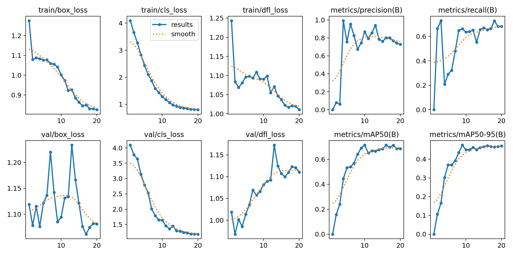
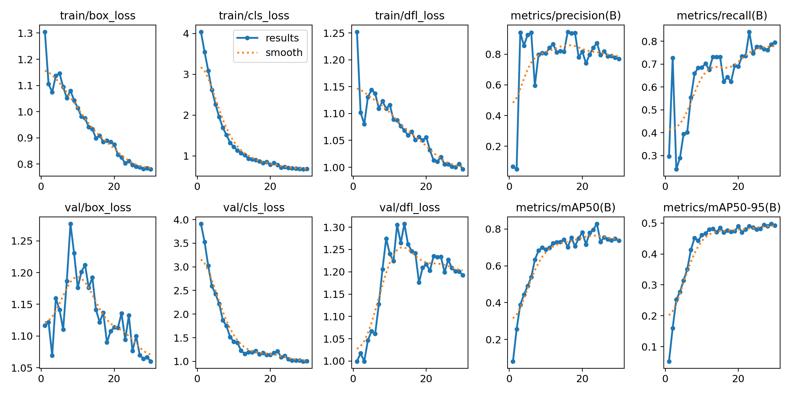

# Отчет.

## 0. Дисклеймер
Перед началом я обдумывал для чего в будет применяться распознавание и почему то подумал что акцент нужно сделать на том в каком состоянии блюда и их тип(салат, суп, горячее), когда руки гостей соприкасаются с едой, и когда убирается оффициант.
Только в конце я понял что более правильно нужно было распознавать не только состояние блюд, но их названия. Может еще и тип.

Я очень давно изучал машинное обучение. Небольшой опыт был около 8 лет назад. Опыта работы с видео и изображениями тоже мало. Соответственно я все время использовал сгенерированные ИИ скрипты.
Также на каждом шаге плотно общался с чат-ботами. chatGTP, deepSeek. 

Не рассчитываю на оффер)) Но раз взялся, то сделал что cмог. В репозитории особо ничего нет, только сгенерированные скрипты которыми пользовался. Верю что инструменты можно подтянуть.
Надеюсь на небольшой фидбэк.

## 1. Определение цели задачи и классов.
Сначала я обумывал задание. Определял классы. В голове была логика бизнес процесса упрощенного - как люди поели суп, салат, основное блюда, что сьели полностью, что нет, к чему вообще не прикасались. Когда приходил оффициант.

Отсюда получил 14 классов:
'soup_full','salad_full','main_course_full','soup_eaten','salad_eaten','main_course_eaten','soup_empty','salad_empty','main_course_empty', 'tea_pot', 'glass', 'hand_waiter', 'hand_guest', 'cutlery'.

## 2. Аннотации.
В папке 6 видео, причем видео 4_1 повторяет конец видео 4. Очевидно 4_1 лишнее.
Сначала разбил по кадрам с шагом в 3 секунды. Этого оказалось мало.
Разбил все видео кроме 4_1 по кадрам с шагом в 2 секунды. Использовал скрипт сгенерированный ИИ. Получилось 143 кадра. Отсмотрел все. Окончательно определил классы.
Для разметки кадров использовал https://github.com/HumanSignal/labelImg/releases. Это версия для винды. Размечал руками все кадры. Около 3 часов.

## 3. Разделение данных на train/val/test.
Сначала я думал просто зашафлить все кадры и разделить. Но пообщался с ИИ и понял что разбить нужно по сценам. Иначе будет утечка данных. Соседние кадры будут везде, что вызовет ложный результат. Модель не научится обобщать.

Я разделил данных по схеме 70/15/15. Хронология на видео была последовательная.
В train вошли кадры с 1-100, в val 101-122, в test 123-143.  Что примерно соответствовало разным сценам. Еда нетронутая, гости едят, пустые блюда и уборка.

## 4. Аугментирование.
Аугментируем только train. Использовал сгенерированный ИИ скрипт.
8 разных аугментации с различной вероятностью.
HorizontalFlip, Rotate, RandomBrightnessContrast, Blur, HueSaturationValue, CoarseDropout, GlassBlur, RandomShadow. Последние два посоветавал ИИ для рестораннх блюд.
Получилось 100 аугментированных кадра. Добавил в train. Итого 200 кадров в train.

## 5. Обучение YOLO.
У меня ультрабук со слабой видеокартой. ИИ предложил обучить в Google Colab. Датасет в Google Drive. Запустил скрипт с YOLO в Google Colab.

### Эксперимент 1. 

#### Гипернастройки:
epochs=20
batch=8

##### Метрики
*Результаты по классам.*

| Класс               | Изображений | Объектов | Precision (P) | Recall (R) | F1-Score | mAP50  | mAP50-95 |
|---------------------|-------------|----------|---------------|-----------|----------|--------|----------|
| **all**             | 22          | 173      | 0.744         | 0.662     | 0.701    | 0.691  | 0.474    |
| main_course_eaten   | 22          | 44       | 0.993         | 1.000     | 0.997    | 0.995  | 0.823    |
| soup_empty          | 7           | 14       | 0.263         | 0.332     | 0.293    | 0.480  | 0.276    |
| salad_empty         | 11          | 22       | 0.619         | 1.000     | 0.764    | 0.963  | 0.701    |
| tea_pot             | 21          | 21       | 0.896         | 0.333     | 0.486    | 0.553  | 0.338    |
| glass               | 22          | 44       | 0.477         | 0.636     | 0.546    | 0.556  | 0.376    |
| hand_waiter         | 3           | 5        | 1.000         | 0.000     | 0.000    | 0.000  | 0.000    |
| hand_guest          | 1           | 2        | 1.000         | 0.996     | 0.998    | 0.995  | 0.547    |
| cutlery             | 21          | 21       | 0.709         | 1.000     | 0.830    | 0.986  | 0.733    |

*Лучшая эпоха: 16*
| Метрика             | Значение |
|---------------------|----------|
| **Precision**       | 0.801    |
| **Recall**          | 0.654    |
| **F1-Score**        | 0.719    |
| **mAP@0.5**         | 0.713    |
| **mAP@0.5:0.95**    | 0.472    |
| **Train Box Loss**  | 0.845    |
| **Train Cls Loss**  | 0.860    |
| **Train DFL Loss**  | 1.023    |
| **Val Box Loss**    | 1.076    |
| **Val Cls Loss**    | 1.240    |
| **Val DFL Loss**    | 1.099    |

*Графики YOLO*

##### Выводы
По результатам выявился класс аутсайдер hand_waiter.  Модель не обучается его находить. 
Также плохие результаты для soup_empty, tea_pot, glass. В рамках поставленной мной задачи результат неудовлетворительный.

Посмотрел распределение объектов по классам в train

| Класс               | Кол-во | Класс               | Кол-во | Класс               | Кол-во |
|---------------------|--------|---------------------|--------|---------------------|--------|
| `glass`             | 416    | `tea_pot`           | 205    | `salad_eaten`       | 196    |
| `cutlery`           | 185    | `main_course_full`  | 307    | `soup_eaten`        | 198    |
| `soup_full`         | 57     | `main_course_eaten` | 87     | `hand_guest`        | 257    |
| `salad_full`        | 116    | `soup_empty`        | 88     | `hand_waiter`       | 26     |
|                     |        | `salad_empty`       | 87     |                     |        |

В val.
| Класс               | Кол-во | Класс               | Кол-во |
|---------------------|--------|---------------------|--------|
| `salad_empty`       | 22     | `tea_pot`           | 21     |
| `soup_empty`        | 14     | `hand_guest`        | 2      |
| `main_course_eaten` | 44     | `cutlery`           | 21     |
| `glass`             | 44     | `hand_waiter`       | 5      |

Мало данных для hand_waiter в train. Мало hand_guest и hand_waiter в val.

### Эксперимент 2.
Пообщался с ИИ. Обдумал его советы. Основными были: поиграться с focal_loss параметром, добавить веса вручную, добавить еще больше аугментации, увеличить количество эпох и уменьшить batch.

focal_loss не поддерживается.

В этом эксперименте я увеличил эпохи, уменьшил batch. Меньше кадров за раз обрабатывает = возможна большая обучаемость на низкочастотные классы.
Также я нашел кадры в train на которых есть hand_waiter. И сделал по три аугментированных копии. Все это добавил в train.

#### Гипернастройки:
epochs=30
batch=4

#### Метрики

*Результаты по классам.*
| Класс               | Изображений | Объектов | Precision | Recall | F1-Score | mAP50   | mAP50-95 |
|---------------------|-------------|----------|-----------|--------|----------|---------|----------|
| **all**             | 22          | 173      | 0.779     | 0.786  | 0.782    | 0.747   | 0.497    |
| main_course_eaten   | 22          | 44       | 0.983     | 1.000  | 0.991    | 0.995   | 0.839    |
| soup_empty          | 7           | 14       | 0.495     | 1.000  | 0.662    | 0.995   | 0.652    |
| salad_empty         | 11          | 22       | 0.956     | 0.996  | 0.976    | 0.993   | 0.678    |
| tea_pot             | 21          | 21       | 1.000     | 0.918  | 0.957    | 0.995   | 0.478    |
| glass               | 22          | 44       | 0.707     | 0.876  | 0.783    | 0.753   | 0.496    |
| hand_waiter         | 3           | 5        | 1.000     | 0.000  | 0.000    | 0.0187  | 0.00749  |
| hand_guest          | 1           | 2        | 0.195     | 0.500  | 0.280    | 0.232   | 0.085    |
| cutlery             | 21          | 21       | 0.892     | 1.000  | 0.943    | 0.995   | 0.743    |

*Лучшая эпоха: 24*
| Метрика             | Значение |
|---------------------|----------|
| **Precision**       | 0.874    |
| **Recall**          | 0.747    |
| **F1-Score**        | 0.805    |
| **mAP@0.5**         | 0.828    |
| **mAP@0.5:0.95**    | 0.486    |
| **Train Box Loss**  | 0.812    |
| **Train Cls Loss**  | 0.734    |
| **Train DFL Loss**  | 1.019    |
| **Val Box Loss**    | 1.133    |
| **Val Cls Loss**    | 1.118    |
| **Val DFL Loss**    | 1.234    |

*Графики YOLO*

### Вывод:
Увеличение эпох значительно увеличило метрики.
soup_empty подтянулся до .995
Но совсем незначительное для hand_waiter mAP@0.5 "увеличился" 0 до 0.0187. 
В рамках поставленной мной задачи результат неудовлетворительный.

### Эксперимент 3. 
Здесь добавил веса для классов. Оставил дополнительные аугментированные кадры с hand_waiter.
Для расчета весов, сначала посчитал как часто встречаются классы в train, и сделал расчет весов обратно пропорционально частоте. Т.е. у самого низковстречаемого класса оказался наибольший вес.
ИИ посоветовал не ставить веса больше 5. Слишком аггрессивно. В итоге у hand_waiter стал вес 5. Тажке поправил вес для soup_empty.

*Веса классов*
| Класс               | Вес   | Класс               | Вес   |
|---------------------|-------|---------------------|-------|
| `soup_full`         | 1.79  | `soup_empty`        | 2.81  |
| `salad_full`        | 1.37  | `salad_empty`       | 1.83  |
| `main_course_full`  | 0.52  | `main_course_empty` | 1.0   |
| `soup_eaten`        | 0.8   | `tea_pot`           | 0.78  |
| `salad_eaten`       | 0.81  | `glass`             | 0.38  |
| `main_course_eaten` | 1.83  | `hand_waiter`       | 5.0   |
|                     |       | `hand_guest`        | 0.62  |
|                     |       | `cutlery`           | 0.86  |

#### Гипернастройки:
epochs=30
batch=4

### Метрики 
*Результаты по классам.*
| Класс             | Изображения | Объекты | Precision | Recall | F1-Score | mAP@0.5 | mAP@0.5:0.95 |
|-------------------|-------------|---------|-----------|--------|----------|---------|--------------|
| **all**           | 22          | 173     | 0.779     | 0.786  | 0.782    | 0.747   | 0.497        |
| main_course_eaten | 22          | 44      | 0.983     | 1.000  | 0.991    | 0.995   | 0.839        |
| soup_empty        | 7           | 14      | 0.495     | 1.000  | 0.662    | 0.995   | 0.652        |
| salad_empty       | 11          | 22      | 0.956     | 0.996  | 0.976    | 0.993   | 0.678        |
| tea_pot           | 21          | 21      | 1.000     | 0.918  | 0.957    | 0.995   | 0.478        |
| glass             | 22          | 44      | 0.707     | 0.876  | 0.783    | 0.753   | 0.496        |
| hand_waiter       | 3           | 5       | 1.000     | 0.000  | 0.000    | 0.0187  | 0.00749      |
| hand_guest        | 1           | 2       | 0.195     | 0.500  | 0.280    | 0.232   | 0.085        |
| cutlery           | 21          | 21      | 0.892     | 1.000  | 0.943    | 0.995   | 0.743        |

*Лучшая эпоха: 20*
| Метрика             | Значение |
|---------------------|----------|
| **Precision**       | 0.874    |
| **Recall**          | 0.747    |
| **F1-Score**        | 0.805    |
| **mAP@0.5**         | 0.828    |
| **mAP@0.5:0.95**    | 0.486    |
| **Train Box Loss**  | 0.812    |
| **Train Cls Loss**  | 0.734    |
| **Train DFL Loss**  | 1.019    |
| **Val Box Loss**    | 1.133    |
| **Val Cls Loss**    | 1.118    |
| **Val DFL Loss**    | 1.234    |

*Графики YOLO*

### Вывод:
Добавление весов ничего не дало(!).
В рамках поставленной мной задачи результат неудовлетворительный.

## 6. Итоговый вывод.
Лучший результат показал Эксперимент 2-3.
По результатам метрик по классам явно видно что классы определяются очень хорошо(блюда разделены только по состоянию), за исключение класса hand_waiter. Показания этого класса занижают общую оценку.
Для хорошоего результата нужно больше данных hand_waiter. И мне кажется что аугментированные тут не очень помогут. Я не стал вставлять кадры, содержащие официанта из val и test в train, 
т.к. это было очень похоже на утечку данных. Кадры там идут друг за другом.

Это наводит на мысли что я все таки неверно понял конечную цель задания. Сейчас я думаю что нужно убрать руки, и добавить классы для всех блюд. 6 уникальных блюд по 3 состояния, чашки и чайник. 18 классов.
И тогда, мне кажется, результаты были бы хорошими, т.к. данных более менее хватало бы.

Примерно стало понятно какие бизнес процессы в сфере horeca можно отслеживать и анализировать.

## 7. Сколько времени потратил.
Ниразу не использовал YOLO.
5.07 - 9 часов
4.07 - 8 часов
В основном обучался с ИИ. Обдумывал полученные знания и подходы к решению. Примерно 3 часа размечал данные. Было 5-6 прогонов, в отчете 3.
Не хватило времения оформить инфраструктуру для проекта. Чтобы все автоматически работало от начала до конца.

Повторить смогу наверное за часа 2 без разметки.